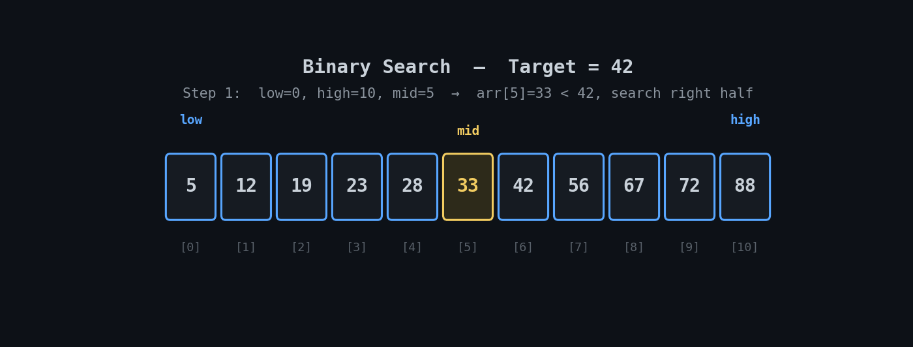

# 🔎 Binary Search

> An implementation of the **Binary Search** algorithm in Python, including function-based and object-oriented approaches.

<p align="center">
  
</p>

---

## 📌 Overview

Binary Search efficiently searches a **sorted** collection by repeatedly dividing the search space in half.

This implementation includes:

* Function-based Binary Search
* Object-oriented `BinarySearch` class
* Step-by-step search tracing
* Dynamic insertion through `add()`

---

## ⚙️ Example

Given:

```text
Array:  [5, 12, 19, 23, 28, 33, 42, 56, 67, 72, 88]
Target: 42
```

The algorithm narrows the search space:

```text
Step 1 → mid = 5  → 33 < 42 → search right
Step 2 → mid = 8  → 67 > 42 → search left
Step 3 → mid = 6  → 42 = 42 → found
```

Output:

```text
Target 42 found at index 6
```

---

## 🐍 Implementation

```python
def binary_search(arr, target):
    low = 0
    high = len(arr) - 1

    while low <= high:
        mid = (low + high) // 2

        if arr[mid] == target:
            return mid
        elif arr[mid] < target:
            low = mid + 1
        else:
            high = mid - 1

    return -1
```

The repository also contains an OOP implementation with:

```text
BinarySearch
├── search()
├── add()
└── __str__()
```

---

## ⏱️ Complexity

| Operation      |   Complexity |
| -------------- | -----------: |
| Best Search    |       `O(1)` |
| Average Search |   `O(log n)` |
| Worst Search   |   `O(log n)` |
| Search Space   |       `O(1)` |
| `add()`        | `O(n log n)` |

> Binary Search requires the data to be sorted.

---

## 📂 Repository

```text
2-Binary-Search/
├── Binary Search.py
├── Binary Search - Lecture.pdf
├── binary_search_demo.gif
├── README.md
└── LICENSE
```

📄 **Detailed explanation:**
See [`Binary Search - Lecture.pdf`](./Binary%20Search%20-%20Lecture.pdf)

---

## 🗺️ DSA Learning Series

This is the **second algorithm** in my DSA learning series.

**Previous:** [1-Linear-Search](https://github.com/zain-cs/1-Linear-Search)

---

## 🚀 Learning Progress

This repository was originally created while I was learning the fundamentals of DSA. I later revisited it to improve the implementation, documentation, and visualization as my programming and software engineering skills developed.

---

## 👨‍💻 Author

**Muhammad Zain-ul-Abidin**

BS Computer Science Student · University of Agriculture, Faisalabad

[GitHub](https://github.com/zain-cs) · [LinkedIn](https://www.linkedin.com/in/muhammad-zain-cs/)
